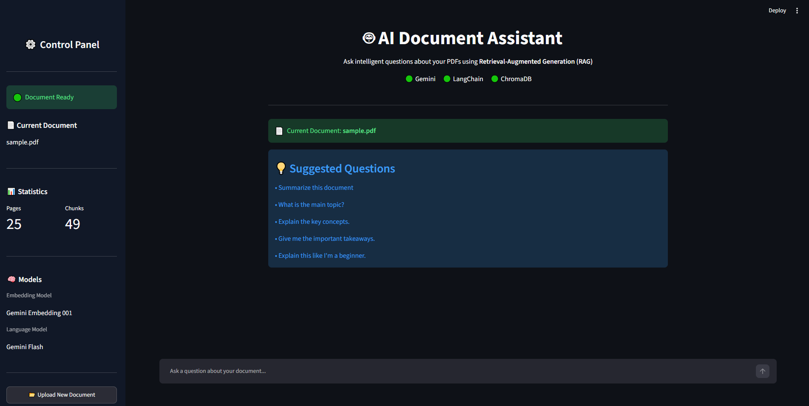
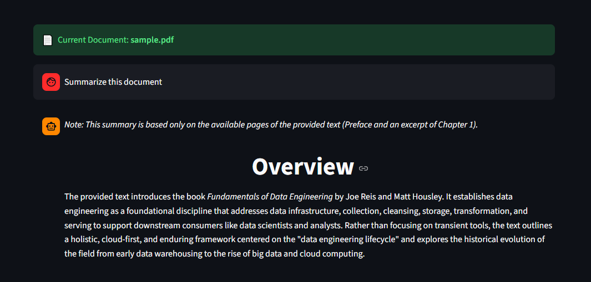
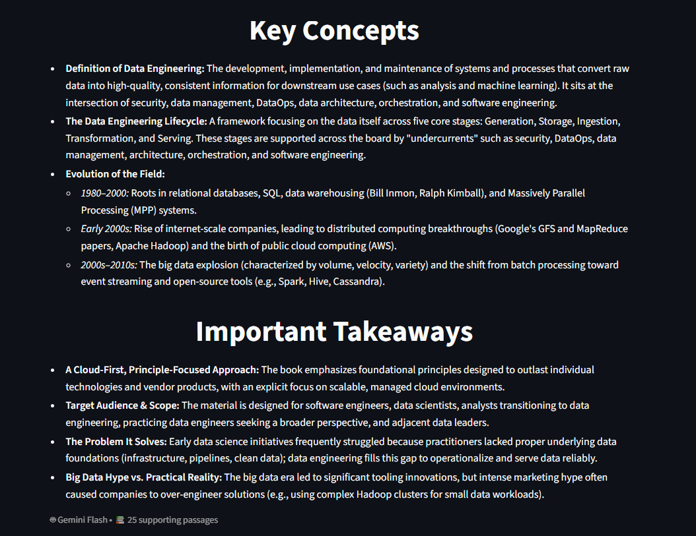

# 🤖 AI Document Assistant

A Retrieval-Augmented Generation (RAG) application that allows users to upload PDF documents and interact with them using natural language.

The application processes uploaded documents, splits them into meaningful chunks, generates semantic embeddings, stores them in a ChromaDB vector database, retrieves relevant passages for each question, and uses Google Gemini to generate grounded answers.

Built with **Python, Streamlit, LangChain, Google Gemini, and ChromaDB**.

---

## 📸 Application

### Document Ready

After processing a document, the application displays document statistics, the active models, and suggested questions to help users get started.

---

### Document Summarization

The application can recognize summary-oriented questions and generate a structured summary containing an overview, key concepts, and important takeaways.

---

### Key Concepts & Takeaways

The generated summary provides structured information extracted from the retrieved document content.

---

# 🧠 What is RAG?

**Retrieval-Augmented Generation (RAG)** combines information retrieval with Large Language Models.

Instead of relying entirely on the model's pretrained knowledge, the application retrieves relevant information from the user's document and supplies it to the LLM as context.

The pipeline is:

    PDF
     │
     ▼
    Document Loading
     │
     ▼
    Text Chunking
     │
     ▼
    Embedding Generation
     │
     ▼
    ChromaDB Vector Store
     │
     ▼
    Semantic Retrieval
     │
     ▼
    Relevant Document Chunks
     │
     ▼
    Google Gemini
     │
     ▼
    Grounded Answer

This approach allows the application to answer questions using information contained within the uploaded document rather than relying solely on the model's general knowledge.

---

# 🏗️ Architecture

    User Uploads PDF
            │
            ▼
       PDF Loader
            │
            ▼
     Document Chunks
            │
            ▼
    Gemini Embeddings
            │
            ▼
        ChromaDB
            │
            │
    User Question
            │
            ▼
        Retriever
            │
            ▼
    Relevant Chunks
            │
            ▼
    Prompt Construction
            │
            ▼
       Gemini Flash
            │
            ▼
     Generated Answer
            │
            ▼
      Streamlit UI

---

# 🔄 RAG Pipeline

## 1. Document Loading

The uploaded PDF is loaded using LangChain's PDF document loader.

The loader converts the PDF into document objects while preserving useful metadata such as page information.

    PDF
     ↓
    Document Objects
     ↓
    Page Metadata + Text

---

## 2. Text Chunking

Large documents are divided into smaller chunks before embedding.

    Document
       │
       ├── Chunk 1
       ├── Chunk 2
       ├── Chunk 3
       ├── ...
       └── Chunk N

Chunking allows the retrieval system to identify specific sections of a document that are relevant to a user's question.

---

## 3. Embedding Generation

Each document chunk is converted into a numerical vector using Google's Gemini embedding model.

Conceptually:

    Document Chunk
          ↓
    Embedding Model
          ↓
    [0.021, -0.183, 0.742, ...]

These vectors represent the semantic meaning of the text and allow similar pieces of information to be found through vector similarity search.

---

## 4. Vector Database

The generated embeddings and their associated document chunks are stored in **ChromaDB**.

When a user asks a question, the question is also converted into an embedding and compared against the stored document embeddings.

---

## 5. Semantic Retrieval

The retriever searches for document chunks that are semantically similar to the user's question.

    User Question
          ↓
    Question Embedding
          ↓
    Similarity Search
          ↓
    Relevant Document Chunks

Only the retrieved chunks are passed to the language model.

---

## 6. Answer Generation

The retrieved chunks are inserted into a prompt and sent to Google Gemini.

The application instructs the model to:

- Use only the retrieved document context
- Avoid inventing information
- Clearly state when information cannot be found
- Produce clear and structured answers
- Use bullet points when appropriate

---

# ✨ Features

- 📄 Upload PDF documents
- ✂️ Split documents into smaller chunks
- 🧠 Generate semantic embeddings
- 🔎 Perform semantic vector search
- 🗄️ Store document embeddings using ChromaDB
- 🤖 Generate grounded answers using Google Gemini
- 💬 Conversational chat interface
- 🧾 Maintain chat history during the session
- 📚 Display retrieved source chunks
- 📑 Display source page numbers
- 📝 Specialized handling for summary-style questions
- 📊 Display document statistics
- 💡 Provide suggested questions
- 🔄 Upload a new document without restarting the application
- 🌙 Dark-themed Streamlit interface

---

# 📝 Intelligent Summarization

The application detects summary-oriented queries such as:

    summarize
    summary
    summarise
    overview
    key points
    main points
    important takeaways

These requests are handled using a dedicated summarization prompt.

The generated response is structured into:

    Overview

    Key Concepts

    Important Takeaways

This produces a more useful response for document-level questions than treating every request as a simple question-answering task.

---

# 📚 Source Transparency

A key feature of the application is that retrieved document chunks are displayed alongside the generated response.

For each retrieved source, the UI displays:

    Source
      ↓
    Page Number
      ↓
    Retrieved Document Chunk

This allows users to inspect the information that was retrieved and understand what document content was supplied to the language model.

The goal is to make the generated answer more transparent rather than presenting the LLM response as an unexplained black box.

---

# 💬 Example Interaction

### User

> What is data engineering?

### Retrieval

The retriever searches the document and identifies relevant passages discussing the definition and responsibilities of data engineering.

### Generation

Gemini receives the retrieved passages as context and generates an answer based on that information.

### Result

The application displays:

    Generated Answer
           │
           ├── Explanation
           ├── Key Points
           └── Supporting Sources

The supporting source sections can then be expanded in the UI to inspect the retrieved document content.

---

# 🛠️ Tech Stack

| Technology | Purpose |
|---|---|
| **Python** | Core application development |
| **Streamlit** | Web application and user interface |
| **LangChain** | Document processing and RAG orchestration |
| **Google Gemini** | Embeddings and language model generation |
| **ChromaDB** | Vector database and similarity search |
| **PyPDFLoader** | PDF document loading |
| **Git / GitHub** | Version control |

---

# 📁 Project Structure

    RAG_document_intelligence/
    │
    ├── app.py
    │
    ├── data/
    │   └── sample.pdf
    │
    ├── screenshots/
    │   ├── 03-document-ready.png
    │   ├── 04-summary.png
    │   └── 05-key-concepts.png
    │
    ├── utils/
    │   ├── __init__.py
    │   ├── embeddings.py
    │   ├── generator.py
    │   ├── loader.py
    │   ├── retriever.py
    │   └── splitter.py
    │
    ├── .gitignore
    ├── README.md
    ├── requirements.txt
    └── list_models.py

Sensitive and generated files such as API keys, the virtual environment, temporary files, and the local vector database are excluded using `.gitignore`.

---

# 🚀 Getting Started

## 1. Clone the Repository

    git clone https://github.com/Sid1813/RAG_document_intelligence.git
    cd RAG_document_intelligence

---

## 2. Create a Virtual Environment

### Windows

    python -m venv venv

Activate it:

    .\venv\Scripts\Activate.ps1

If PowerShell prevents script execution, the application can still be run directly using the virtual environment's Python executable.

---

## 3. Install Dependencies

    pip install -r requirements.txt

---

## 4. Configure the Gemini API Key

Create a `.env` file in the project root:

    GOOGLE_API_KEY=your_api_key_here

**Never commit your `.env` file to GitHub.**

The `.gitignore` file excludes it from version control.

---

## 5. Run the Application

    streamlit run app.py

Alternatively, on Windows:

    .\venv\Scripts\python.exe -m streamlit run app.py

Streamlit will provide a local URL that can be opened in a browser.

---

# ⚙️ Models

The application currently uses Google Gemini for two major components.

### Embedding Model

**Gemini Embedding**

Used to transform document chunks and user queries into numerical vector representations.

### Language Model

**Gemini Flash**

Used to generate answers from the retrieved document context.

---

# 📊 Document Processing Example

For example, a document processed by the application may be displayed as:

    Document: sample.pdf

    Pages: 25
    Chunks: 49

The chunks are then embedded and stored in ChromaDB for semantic retrieval.

---

# 🔐 Environment & Security

API credentials are loaded through environment variables rather than being hard-coded into the application.

The following files are intentionally excluded from Git:

    .env
    venv/
    vector_db/
    temp.pdf
    __pycache__/

This prevents sensitive credentials and locally generated artifacts from being committed to the repository.

---

# 🧩 Design Philosophy

The application separates the major components of the RAG pipeline into independent modules:

    loader.py
         ↓
    splitter.py
         ↓
    embeddings.py
         ↓
    retriever.py
         ↓
    generator.py
         ↓
    app.py

This modular structure makes it possible to improve or replace individual components without rewriting the entire application.

For example:

- The embedding model can be changed independently.
- Retrieval strategies can be improved without modifying the UI.
- The LLM can be replaced without rewriting document processing.
- The Streamlit interface remains separate from the core RAG logic.

---

# 🎯 What I Learned

This project was built as a hands-on exploration of modern AI/ML engineering concepts, including:

- Retrieval-Augmented Generation
- Vector embeddings
- Vector databases
- Semantic search
- Document chunking
- Prompt engineering
- LLM-based question answering
- LLM-based summarization
- LangChain
- ChromaDB
- Streamlit
- Modular AI application architecture
- Git and GitHub

The project focuses on understanding the complete path from **raw document → retrieval → LLM generation → user-facing answer**.

---

# 📌 Project Status

**Status: Functional Prototype**

The complete core pipeline is operational:

    PDF
     ↓
    Load
     ↓
    Chunk
     ↓
    Embed
     ↓
    Store
     ↓
    Retrieve
     ↓
    Generate
     ↓
    Display Answer + Sources

---

# 👨‍💻 Author

**Siddharth Ranganatha**

GitHub: [@Sid1813](https://github.com/Sid1813)
